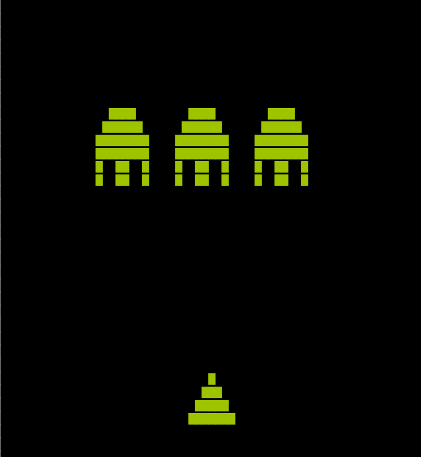
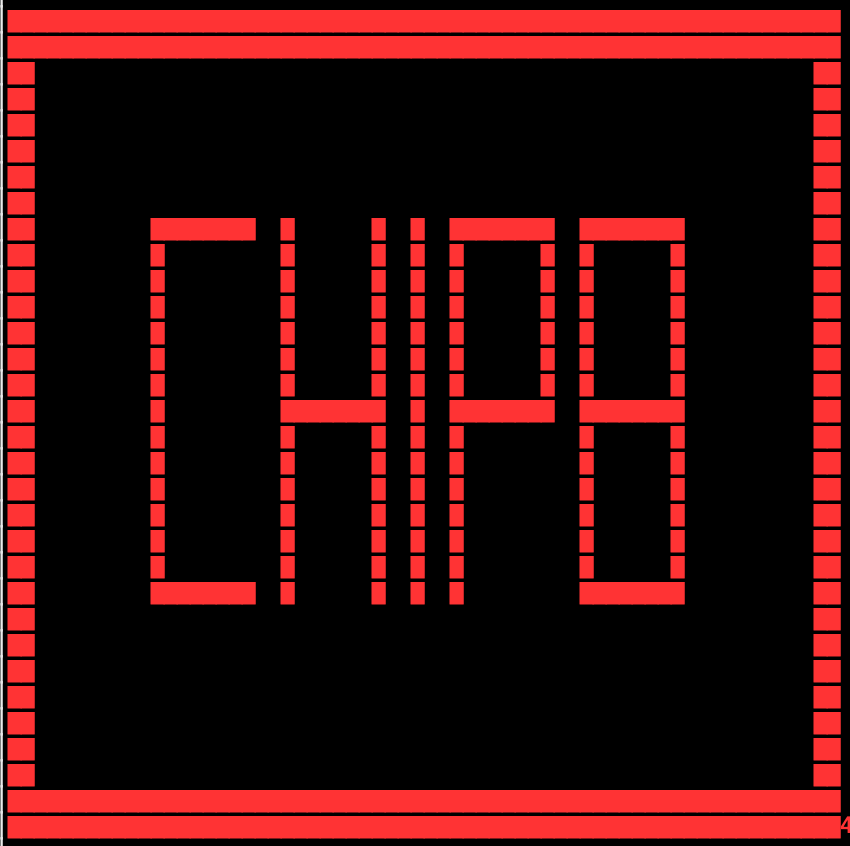

### Chip8 Emulator, written in _Rust_

<p>
  
  
  
  
  
  
</p>

_A set of ROMs run on this emulator (The maze, "IBM", and "Chip8" are pictures, while "Space Invaders" and "Tetris" are playable)._

#### What is it?
- CHIP-8, is an interpreted programming language, that was designed for the COSMAC VIP and Telmac computers.
- The programs are run on a CHIP-8 virtual machine, which each of the respective computers implemented. 
- This project then, is _really_ an emulator _for_ the virtual machine.

#### Why I'd build this? (spoiler: to learn)
- There's nothing new here, not much value other than it being a learning experience for myself both in exploring the architecture of older computers, and _Rust_ as a programming language.
- The CHIP-8 VM is arguably the best entry point for building an emulator, as it consists of a minimal instruction set, and an extensive set of resources to learn from.

#### Features
- This emulator is capable of running a handful of the most popular ROMs. I've personally tested _Pong_, _Tetris_, _Space Invaders_ and a few others, all of which can be found [here](https://github.com/dmatlack/chip8/tree/master/roms).

#### Installation
```sh
  $ git clone https://github.com/paarthmadan/chip8.git && cd chip8
  $ cargo install --path .
```

#### Usage
```
  chip8 0.1.0
  A CHIP-8 VM emulator.

  USAGE:
      chip8 [OPTIONS] <PATH_TO_ROM>

  FLAGS:
      -h, --help       Prints help information
      -V, --version    Prints version information

  OPTIONS:
      -c, --clock-rate <clock-rate>     [default: 250]
      -s, --symbol <symbol>             [default: █]

  ARGS:
      <PATH_TO_ROM>    
```

#### What's Left?
- [ ] Custom colours and output symbol
- [ ] Scale "hardware" display (apply a linear scale on the display matrix)
- [ ] Refactor to opt for idiomatic Rust
- [x] Custom clock rate
- [ ] Add terminate path
- [ ] Handle finished execution


#### Resources
To build this project I relied heavily on this [Cowgod's CHIP-8 spec](http://devernay.free.fr/hacks/chip8/C8TECH10.HTM#8xy6). I later learned that there are some minor inconsistencies and errors, so in the latter half of the project I relied on [mattmik's resource](http://mattmik.com/files/chip8/mastering/chip8.html).
